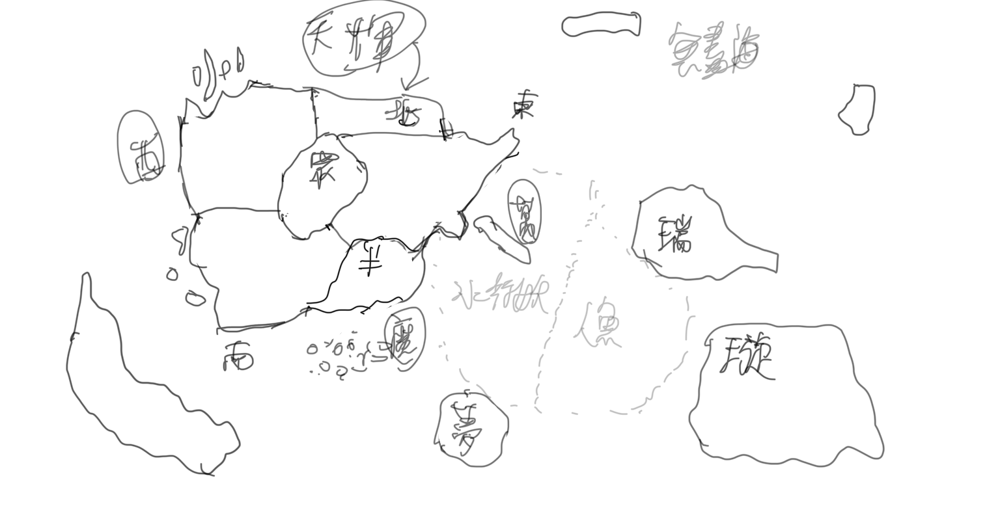

# 世界觀&地理

[最大世界觀架構](%E6%9C%80%E5%A4%A7%E4%B8%96%E7%95%8C%E8%A7%80%E6%9E%B6%E6%A7%8B%2028d8e504efab436e846d4d7542aef208.md)

[蒼究世界簡介](%E8%92%BC%E7%A9%B6%E4%B8%96%E7%95%8C%E7%B0%A1%E4%BB%8B%20afb02b079ac14368bc5aac3f85480262.md)

蒼究主軸世界

---

主軸世界外觀

蒼究為「空間部份循環立方體界面」，雲層上、地底下有界面障壁。

平面座標為折疊空間：水平向正前方投擲一物體，若其永不落地，理論上會從正後方飛來。

實際上，蒼究世界是「神鳥次元族族長—蒼天」的體內空間，而神鳥次元族族長就是所謂的「蒼天」。僅有少數接觸神之領域，或是與其它界面有所接觸者知曉此資訊。

PS：神鳥次元族族長將體內世界設定為「非私人」。

因此管理內部眾生的權限交由「神」，她只能在一定程度上制定法則，不得輕易干預內部。

主軸世界大小

📌水平面積約260億平方公里（約地球表面積51倍）

📌界面頂高度約海拔6400公里（約地球增溫層頂10.2倍）

📌地平線距地底之深度約6400公里（約地球距地心之1.07倍）

主軸世界地圖

[天輝大陸](%E5%A4%A9%E8%BC%9D%E5%A4%A7%E9%99%B8%206f413ce7050d4fedbf21c358c6f01bc5.md)

[瑞澤大陸](%E7%91%9E%E6%BE%A4%E5%A4%A7%E9%99%B8%20f8c9cdc0f7764513b4ce23520038c838.md)

[璇霄大陸](%E7%92%87%E9%9C%84%E5%A4%A7%E9%99%B8%205fa1c700c8da41feb3356ebb2db2fc48.md)

[夢之殤](%E5%A4%A2%E4%B9%8B%E6%AE%A4%20cdf4c08a156440f3bca27d3c7fe27aa7.md)

[魔域群島](%E9%AD%94%E5%9F%9F%E7%BE%A4%E5%B3%B6%20950afb2a698947cb91a9e4d3514fc5f6.md)

[萬魔之巔](%E8%90%AC%E9%AD%94%E4%B9%8B%E5%B7%94%205ea59f4be0d0443a983e8615b40e4102.md)

[幽影大陸](%E5%B9%BD%E5%BD%B1%E5%A4%A7%E9%99%B8%20206a954e23d94b8c8440c59a70aab580.md)

[無盡海地區](%E7%84%A1%E7%9B%A1%E6%B5%B7%E5%9C%B0%E5%8D%80%20c7521a49ecb2449fb1088d657d8f68f4.md)

---

旁支世界

---

裡世界

目前主要推測是由生靈的臆想意外產生「願」，進而產生之存在。

但目前尚沒有確切證據支持該論點。（除非作者本人有想到合理解釋～）

[影之世界](%E5%BD%B1%E4%B9%8B%E4%B8%96%E7%95%8C%207b4f72268d2e4d5d837b4b9d92628db7.md)

[次元蟲洞](%E6%AC%A1%E5%85%83%E8%9F%B2%E6%B4%9E%205fc78180e8444d08bd4d82d6d3f9a1fa.md)

[鏡像世界](%E9%8F%A1%E5%83%8F%E4%B8%96%E7%95%8C%202df4082b6d7e4960a3e4a3134d316d6a.md)

[數位世界](%E6%95%B8%E4%BD%8D%E4%B8%96%E7%95%8C%20ede03253466a43fd90f58df602abb092.md)

---

整合世界

神界

至高神壇、天宮、眾神廳、星座、神域、域外虛空。

[神界基本設定](%E7%A5%9E%E7%95%8C%E5%9F%BA%E6%9C%AC%E8%A8%AD%E5%AE%9A%209c0ee12bbc7c491289a18d200cc78dec.md)

靈界

[靈界世界觀概述](%E9%9D%88%E7%95%8C%E4%B8%96%E7%95%8C%E8%A7%80%E6%A6%82%E8%BF%B0%20b9003be77a7e40018f3700691ab49f08.md)

冥界

[冥界](%E5%86%A5%E7%95%8C%2043cfac7a66554a17915d11aa9e7a6c0a.md)

輪迴界

[輪迴界](%E8%BC%AA%E8%BF%B4%E7%95%8C%2023509e82774d4773a3856c496c8cc0ae.md)

---

其它世界

宇宙

[宇宙](%E5%AE%87%E5%AE%99%2020b3f0415ddd4990a8468320fe42e5b9.md)

仙界

[仙界](%E4%BB%99%E7%95%8C%206875f2946cf941419dc9209d5ec96a87.md)

---

特殊異空間

[祕境](%E7%A5%95%E5%A2%83%20d4c6eb743a7c4966a2ba89a030c330ca.md)

[高塔](%E9%AB%98%E5%A1%94%206b43d973d1ef4e19a07ca0914e8c2f65.md)

[地下城](%E5%9C%B0%E4%B8%8B%E5%9F%8E%201fd2ee60a6ce46e1b7089b6aa33f56fa.md)

[迷宮](%E8%BF%B7%E5%AE%AE%2076d0c61859324abea4fc253675e639a4.md)

[次元門](%E6%AC%A1%E5%85%83%E9%96%80%20aaba2faf276e4a8cb0a195a38ec0c8f7.md)

[遺跡](%E9%81%BA%E8%B7%A1%20c93dca847a0b4b5a9579f8c7bb7e78cb.md)

---

天文：

[特殊星體](%E7%89%B9%E6%AE%8A%E6%98%9F%E9%AB%94%201a4f38cb84a18085bff7d76826a8d4a8.md)

[特殊星座](%E7%89%B9%E6%AE%8A%E6%98%9F%E5%BA%A7%201a4f38cb84a180719d00c37e6a604ba4.md)

---

地理：

人族：未來高科技城市、現代城市、鄉村小鎮、奇幻城市、仙雲高山、古風城鎮。

普通：森林、草原、山地、峽谷、湖泊、湧泉、河川、雪地、沙漠、火山、沼澤、海岸、大海、島嶼。（多為精怪體系、萬獸體系的勢力分佈）

特殊：聖域、高空雲層、龍巢、上古遺跡、傳承之地、神廟、地底世界。

混亂界域（法則之地）

時間長河、空間裂縫、次元門、輪迴殿、因果脈、世界樹。